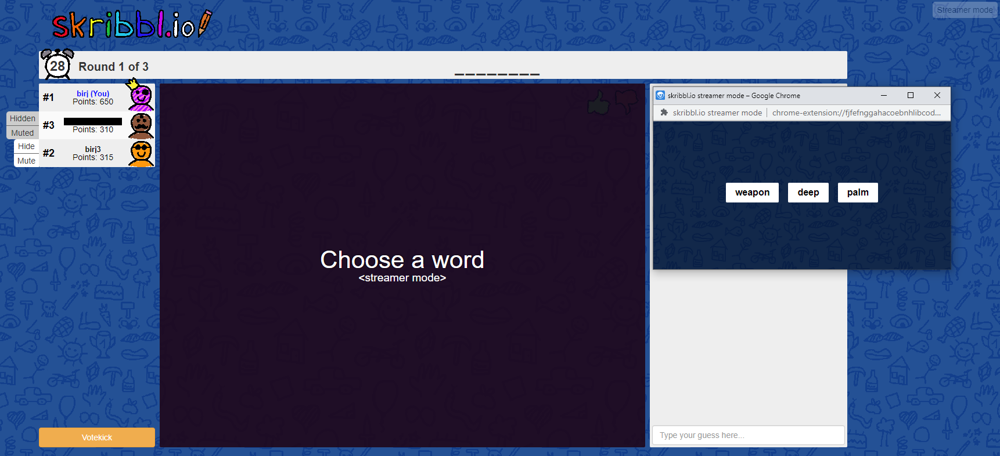

# skribbl.io-streamer-mode

Super quick browser extension to add streamer mode to skribbl.io.

### Features:

<dl>
  <dt>Anti-spoiling</dt>
  <dd>Hide anything that would give away what you're currently drawing (word list when it's time to pick word, current word at top while drawing) so it doesn't show up on stream. It will instead be displayed in a separate popup.</dd>
  <dt>Moderation</dt>
  <dd>Hide chat messages and drawings of any player. Helps avoid trolls drawing edgy stuff or spamming chat.</dd>
</dl>

## Installation

Download the files for the project, then add the folder as an unpacked extension to your browser of choice.

<dl>
  <dt>Chrome</dt>
  <dd>
  Navigate to <code>chrome://extensions</code>.
  
  Enable developer mode (top right) and click "Load unpacked" (top left). Choose the folder containing <code>manifest.json</code>.
  
  You should now have an extension loaded called "skribbl.io streamer mode".
  </dd>
  <dt>Firefox</dt>
  <dd>
  Navigate to <code>about:debugging</code>.
  
  Click "This Firefox" (top left) and then "Load Temporary Add-on...". Choose the file <code>manifest.json</code>.
  
  You should now have an extension loaded called "skribbl.io streamer mode".
  </dd>
</dl>

## Usage

The extension will automatically remove the words from the skribbl.io website so as not to give away anything if you're streaming the game.  
The word list will instead be moved into a separate popup window, in which you can choose the word to draw as if it was done on the skribbl.io website.

You can open the popup by clicking the "Streamer mode" button that is added to the top-right of every page on skribbl.io.  
This popup will contain the list of words you can choose from when it's your turn to draw, as well as the current word while you're drawing.

